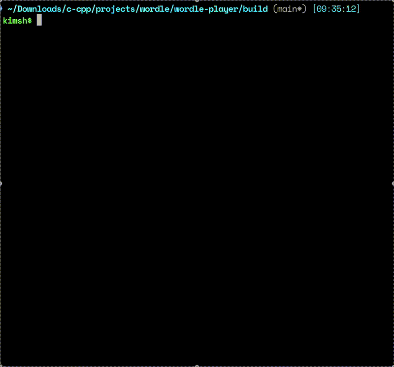

# wordle-player

## Word of the Day



## Benchmark


## Usage
```
Usage: wp COMMAND

Fast and efficient player for Wordle (nytimes.com).

Commands:
  play [WORD]    Solve word of the day from Wordle (nytimes.com) or solve your own (valid) 5-letter word
  peek           Show word of the day
  bm [OPENER]    Benchmark performance with default opener (PARES) or with your own (valid) opener
  bmv [OPENER]   Benchmark performance verbose
  help           Show this help message and exit

Examples:
  wp play
  wp play SHARE
  wp bm
  wp bm PROXY
  ```

## Details

* `wordle-player` builds a modified version of an NLP data structure known as an
inverted index to organize valid guesses into unordered sets based on the
position of their letters.

* Then, a combination of set operations union, intersection, and difference are
performed on the inverted index according to the feedback from the tiles (green
for corret letter and position, yellow for correct letter and wrong position,
and gray for wrong letter).

* A narrower, unordered set of valid guesses is produced as a result of the set
operations for which a new inverted index is built.

* From the narrower set of valid guesses, the guessing strategy involves a word scorer based primarily on the relative
frequency of letters in the set. The word scorer is applied every second and fourth try to pick the most
optimal guess. On every other try, a random word from the set is picked as the guess.

* This procedure is repeated in a recursive call until it arrives at the
correct word.

## Note

* Project must be built in a separate subdirectory of the root directory, and
not in the root direcotry itself for it to find the `assets` folder.

## Credits

* `valid-wordle-words.txt` provided by [dracos](https://gist.github.com/dracos/dd0668f281e685bad51479e5acaadb93)
